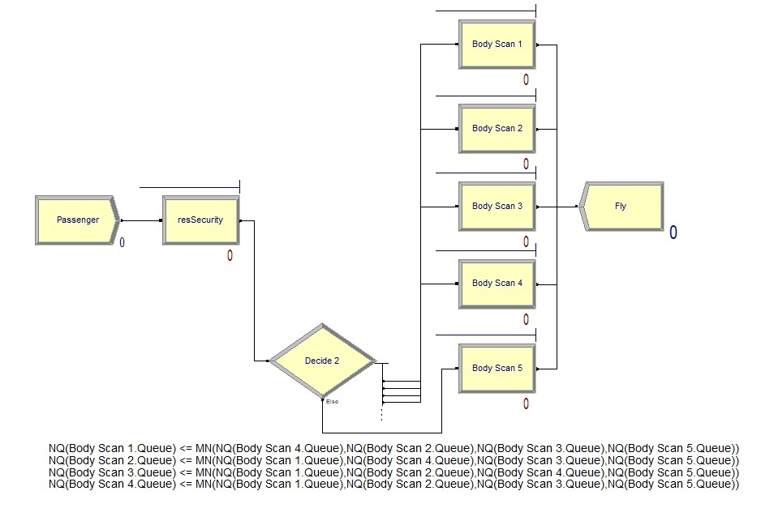
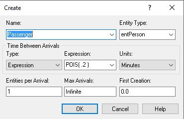
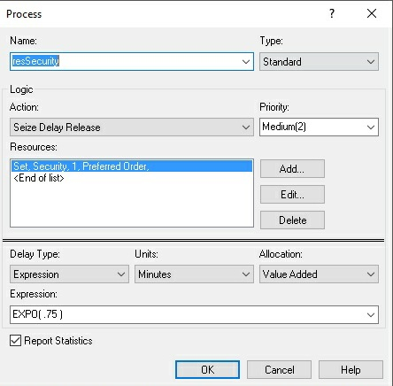
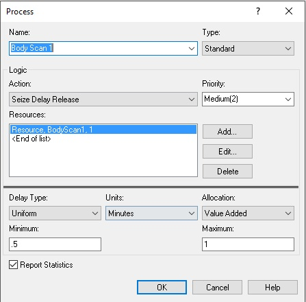
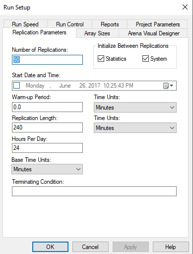

# Question 1
In this problem you, can simulate a simplified airport security system at a busy airport. Passengers arrive
according to a Poisson distribution with λ1 = 5 per minute (i.e., mean interarrival rate µ1 = 0.2 minutes)
to the ID/boarding-pass check queue, where there are several servers who each have exponential
service time with mean rate µ2 = 0.75 minutes. [Hint: model them as one block that has more than one
resource.] After that, the passengers are assigned to the shortest of the several personal-check queues,
where they go through the personal scanner (time is uniformly distributed between 0.5 minutes and 1
minute).
Use the Arena software (PC users) or Python with SimPy (Mac users) to build a simulation of the system,
and then vary the number of ID/boarding-pass checkers and personal-check queues to determine how
many are needed to keep average wait times below 15 minutes.


### Flow Diagram
The flow is layed out fairly simply.  
1. The passenger is generated 
2. The passenger passes through a security process block
3. The passenger passes through a decision block to find the shortest body scan line
4. The passenger goes through a Body Scan processs block
5. The passenger is able to get on their plane



### Create block
The problem specified that the passenger comes to the security line with respect to a poisson distribution with a $\lambda$ of 5 person per minute.  This translates to a $\mu$ of 0.2.



### Security Process Block
The user then must be processed by a security guard.  This is created as a set of 5 units so that each of them can process a different person at a time.  Each of them also processes the passengers at a rate defined by the an exponential distribution with a mean of 0.75.




### Decision Block
Image of the decision block can be seen in the above flow diagram along with its logic.  Here, we go through 4 decision points where each of them determines whether they are the shortest line by seeing if they are less than or equal to the minimal value of all the other queues.

### Body Scan Process Block
From each of the output of the decision block, we create a process block for the passenger to pass through the body scanner.  They have a uniform distribution with a minimum of 30 seconds to a maximum of 1 minute.



### Simulation Run
For the run setup, I ran my simulation for 50 replications and ran each of them for 4 hours.  I've hit errors going any higher than this due to the fact that the software is the student version.



### Reported Data
**Number Out**: 1175

**Avg Wait time per person**: 2.65 mins

**Total Time per person**: 4.15 mins

**Security Utilization**: 0.77 to 0.86

**Body Scan Utilization**: 0.57 to 0.99


### Optimizing
I tried to decrease the number of Security and also the number of Body Scanners.  However, every time I do so, I hit the 150 limit.  It looks like if I want passengers to wait around 15 minutes and optimize my resources, I would need to pay for this program.

# Question 2 
 
The breast cancer [data] set([description]) has missing values. 

1. Use the mean/mode imputation method to impute values for the missing data. 
2. Use regression to impute values for the missing data. 
3. Use regression with perturbation to impute values for the missing data. 
4. (Optional) Compare the results and quality of classification models (e.g., SVM, KNN) build using (1) the data sets from questions 1,2,3; (2) the data that remains after data points with missing values are removed; and (3) the data set when a binary variable is introduced to indicate missing values. 

[data]: http://archive.ics.uci.edu/ml/machine-learning-databases/breast-cancerwisconsin/
[description]: http://archive.ics.uci.edu/ml/datasets/Breast+Cancer+Wisconsin+%28Original%29 
 

### Mean/Mode Imputation
In order to do mean/mode imputation, I will need to first find the data points that are missing.  I ran a quick summary on the data just to see whether any NA values turned up.
```{r}
data <- read.table("breast-cancer-wisconsin.data.txt",stringsAsFactors=FALSE,header=FALSE,sep=",")
set.seed(1)
summary(data)
```
I didn't see any but, it is strange that V7 showed a class of character when the data descriptions clearly showed that it would have a value of 1-10.  Does this mean there may be data corruption in there?  I'm going to display each distinct value listed in this column with the unique function.

```{r}
t(unique(data['V7']))
```
It looks like we somehow have 24 instances of the "?" as a data element in this column.  Next we can extract the non-error data, calculate its mode.  Mode function was found on [stackoverflow]

[stackoverflow]: https://stackoverflow.com/questions/2547402/is-there-a-built-in-function-for-finding-the-mode

```{r}
#Find the missing data indicies
missing <- which(data$V7 == "?",arr.ind=TRUE)

#Create mode function
Mode <- function(x) {
  ux <- unique(x)
  ux[which.max(tabulate(match(x, ux)))]
}

#find the mode
V7mode <- as.numeric(Mode(data[-missing, "V7"]))

#fill in the missing data with the mode
imputeData <- data
imputeData[missing,]$V7 <- V7mode
imputeData$V7 <- as.integer(imputeData$V7)
```

```{r}
t(unique(imputeData['V7']))
```
Looking at the new list of unique values, we see that the data has been filled in and the "?" is gone.


### Regression Imputation
Since these are categorical data, I'll need to use multinomial regression to predict the most likely class for the data.
```{r,results='hide'}
library(nnet)
library(ggplot2)

set.seed(1)
regressData <- data
regImputeModel <- multinom(V7~V2+V3+V4+V5+V6+V8+V9+V10,data=regressData[-missing,])
V7pred <- predict(regImputeModel,newdata=regressData[missing,])

regressData[missing,]$V7 <- V7pred
regressData$V7 <- as.numeric(regressData$V7)
```
```{r}
t(unique(regressData['V7']))
```
Looking at the new list of unique values, we see that the data has been filled in and the "?" is gone.

### Regression Imputation With Perturbation
To determine what the perturbation I should use on this data should be, I'll need to take a look at the distribution of the error for our data.

```{r,results='hide'}
set.seed(1)
perturbData <- data
perturbModel <- multinom(V7~V2+V3+V4+V5+V6+V8+V9+V10,data=perturbData[-missing,])
trainPred <- predict(perturbModel,newdata=perturbData[-missing,])
diff <- as.matrix(as.numeric(trainPred))-as.matrix(as.numeric(perturbData[-missing,]$V7))
```
```{r}
qplot(as.matrix(diff[which(diff!=0)]),binwidth=1)+labs(title="Histogram of Predicted Errors for V7", x="Amount Different")
```

I see a large amount of error around the -9 mark which means our predicted value keeps overshooting the actual value.  But this error seems pretty significant while the rest are almost a normal distribution.  This makes me think some features behave more line binary values.  Doing some further research into cancer imaging diagnostics and bare nuclei, I found this [article] which identified bare nuclei as something that exists.  This makes me believe this feature is more of a binary value with a confidence interval.  For example, if the image does have bare nuclei, it would have a value of 10 and if it doesn't it would have a value of 1.  Anything in between is an unsure value.  Of course, in real life, I would need to reach out to the researcher to identify what this feature actually means.  But for this course, I will assume that it is okay to treat this feature as continuous.  Because of this, I will continue with using Linear regression.

[article]: https://breast-cancer-research.biomedcentral.com/articles/10.1186/bcr721

```{r}
set.seed(1)
pertSubData <-perturbData[-missing,]
pertSubData$V7 <- as.numeric(pertSubData$V7)
perturbLMModel <- glm(V7~V2+V3+V4+V5+V6+V8+V9+V10,data=pertSubData)
qplot(perturbLMModel$residuals,binwidth=1)+labs(title="Histogram of Predicted Errors for V7", x="Amount Different")
```
Now this looks much better once we started to treat it like continuous data.  I took a look at the mean and standard deviation shown below and those are the values we will use for our randomized normal distribution of perturbation values.

```{r}
print(paste0("mean: ",mean(perturbLMModel$residuals)))
print(paste0("sd: ",sd(perturbLMModel$residuals)))
```

Here I built the predicted value with our normal distribution around mean 0 and sd 2.26.  I added a pmin and pmax function to limit it between 0 and 10
```{r}
set.seed(1)
V7pred <- predict(perturbLMModel,newdata=perturbData[missing,])
perturbData[missing,]$V7 <- pmax(pmin(round(V7pred+rnorm(length(V7pred),0,2.26)),10),0)
perturbData$V7 <- as.numeric(perturbData$V7)
```

Here I'm comparing the filled in values to see how they vary.  It looks like the perturbData varies pretty significantly.
```{r}
imputeData[missing,]$V7
regressData[missing,]$V7
perturbData[missing,]$V7
```


### Creating missing value dataset
Creating the two datasets
```{r}
removeData <- data[-missing,]
binaryData <- data
binaryData[missing,]$V7 <- 0
binaryData$V7_1 <- rep(0,dim(data)[1])
binaryData[missing,]$V7_1 <- 1
```


I ran a small KNN test on the data set by dividing it up into train val and test.
```{r}
library(kknn)
library(caret)
library(e1071)

set.seed(1)

formula=formula(V11~V2+V3+V4+V5+V6+V7+V8+V9+V10)
formula2=formula(V11~V2+V3+V4+V5+V6+V7+V8+V9+V10+V7_1)

knnRun <- function(funcData,formula)
{
  funcData$V11=as.factor(funcData$V11)
  #Using createDataPartition to separate data to have similar ratio of dependent variables
  trainIndex <- createDataPartition(funcData$V11, p = .8, list = FALSE, times = 1)
  trainset <- funcData[trainIndex,]
  valIndex <- createDataPartition(trainset$V11, p = .25, list = FALSE, times = 1)
  
  #partitions
  train <- trainset[-valIndex,]
  val <- trainset[valIndex,]
  test <- funcData[-trainIndex,]
  
  model <- kknn(formula=formula,train=train,test=val,k=10)
  confMat <- confusionMatrix(model$fitted.values,val$V11)
  
  return(confMat)
}

imputeClass <- knnRun(imputeData,formula)
regressClass <- knnRun(regressData,formula)
perturbClass <- knnRun(perturbData,formula)
removeClass <- knnRun(removeData,formula)
binaryClass <- knnRun(binaryData,formula2)
```

```{r}
val <- rbind(imputeClass$byClass,regressClass$byClass,perturbClass$byClass,removeClass$byClass,binaryClass$byClass)
rownames(val) <- c("impute","regress","perturb","remove","binary")
val
```
From this run, we can see that there really isn't a significant amount of differences between each of the methods.  But we also only had around 10 missing values out of 700 samples, I don't think such a small number will affect our final outcome.

#Question 3 
 
Describe a situation or problem from your job, everyday life, current events, etc., for which optimization would be appropriate. What data would you need?

## Response
One major problem that faces all of the employee at my company is finding the best way to get from point A to point B on each campus.  Below is a map of what it looks like without the two additional campuses build within the last year.  This is an optimization problem that google has already faced and solved.  Let's break it down into our Variables, Constraints, and objective function.

### Variables
Variables are decisions that the model would need to optimize to find the best values for.  In our case, each individual divide in a path and the length of the path would be our variable.  When we optimize for the fastest route, it may give us a different result than when we optimize for the shortest route.  Recently, we added shuttles to our campus.  This adds the variables of the stops that the shuttles will take.

### Constraints
**Time**: When traveling across campus, it is usually due to the fact that we have a meeting that we need to physically be at.  The amount of time is going to be a constraint.

**Event**: During certain events, we may have horse draw carriages on campus that will take up the whole route and block people from clearing a path quickly.  This can prevent an optimization model from taking certain paths which we can model a probability of it being slower by a normal distribution.

### Objective Function
This is the function that we need to solve to define what would be the fastest route from one location to another.


